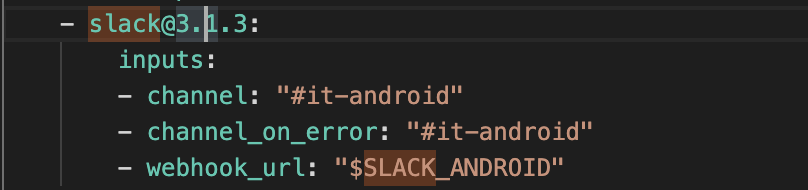

### Get Bitrise build notifications in Slack
If you happen to use **Bitrise** for CI(continuous integration), it will probably save you some time getting build notifications in your Slack channel rather than staring and waiting for build to succeed or fail in the Bitrise interface. It wasn't so straightforward setting up webhook for Bitrise in Slack, so here is my 2-min step-by-step guide!

#### Step 1
Click on your company's name in Slack -> Select _Customize Slack_ -> _Configure Apps_ -> _Custom Integrations_ -> _Incoming WebHooks_.
#### Step 2
Add new incoming WebHooks integration and choose a channel. Copy the WebHook Url you see
#### Step 3
Go to Bitrise, select a project you want build notifications for -> _Workflow Editor_ -> _Env Vars_ and add new environment variable, for instance ```$SLACK_ANDROID = https://hooks.slack/services/yourwebhookurl```
#### Step 4
Go to the tab Workflow, select the right Workflow from dropdown. Add Slack as the last step to the flow. Paste the URL in
 and **done!** (customize by filling in other fields)
#### Debug
If your Bitrise CI build still doesn't show up in your Slack channel, check out Bitrise.yml file and the build log of your branch to see what's missing. In my case, I used a secret environment variable instead of a regular environment variable which caused the WebHook Url to be empty. 
